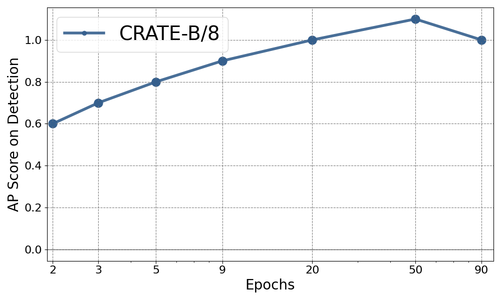
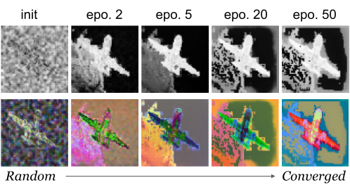
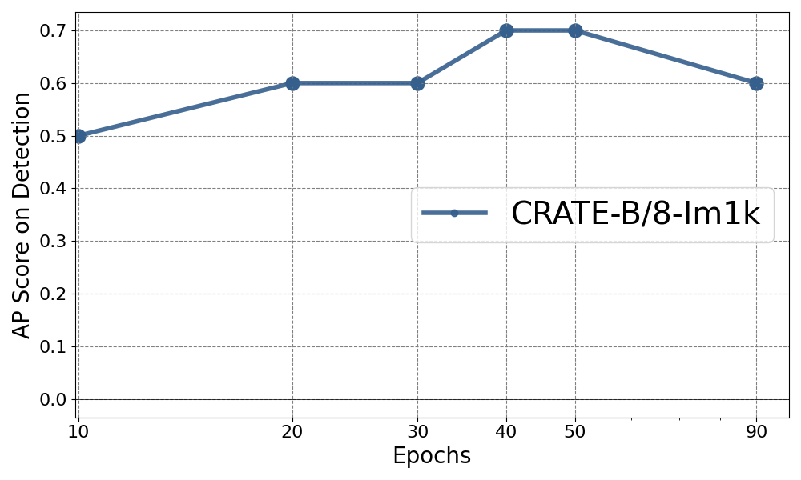
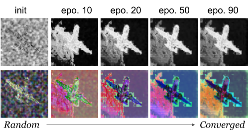
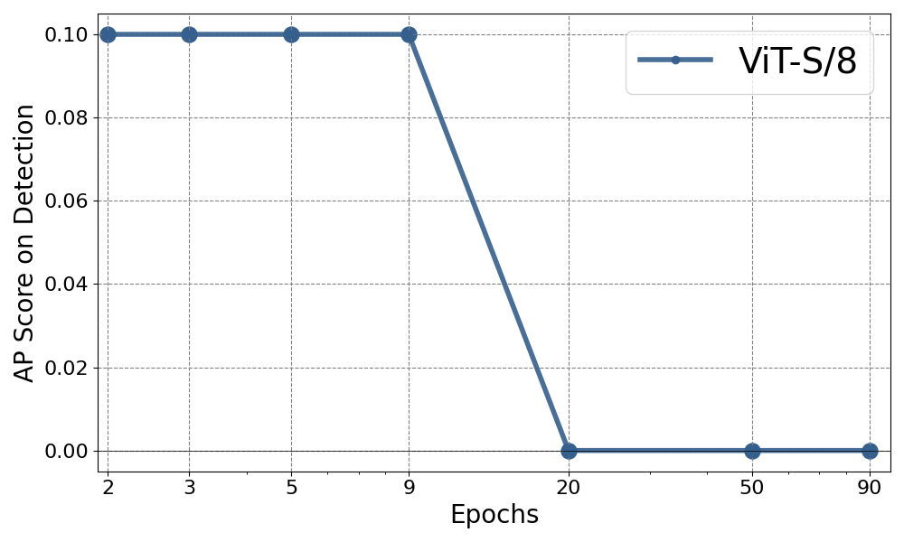
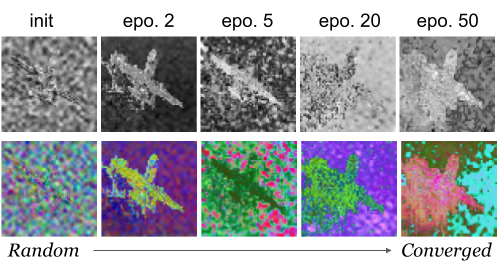

# Rebuttal Supplementary Material

**Figure 16: Attention map of CRATE-S/8 when pre-trained on ImageNet-21k and fine-tuned on Oxford-flower.** We still observe the clear segmentation properties.

 

**Figure 17: Effect of training epochs for CRATE-B/8 when pre-trained on ImageNet-21k.**

 

**Figure 18: Effect of training epochs for CRATE-B/8 when pre-trained on ImageNet-1k.**

**Figure 4: Effect of training epochs for ViT-S/8 when pre-trained on ImageNet-21k.**